# CodinGame Clash Results Automation

## Description
A Selenium-based project that is able to automate Clash Results on CodinGame into a CSV file that can be opened in Microsoft Excel. This allows for quicker checking by a supervisor/clash host to check for attendance, how well all participants did and whether or not each participant's code is viewable.

## System Requirements
- FireFox
- System Environmental Variables
- Git

## Technologies Used
- Java - Version 1.8
- Maven
- Selenium - Version 3.141.59
- Web Driver Manager - Version 3.7.1
- OpenCSV - Version 5.4

## Working Environment
- Spring Tool Suite - Version 4.10 (Used for building the Java application)
- GitHub/GitBash - Used for version-control

## Features
- Log-In functionality for a user to be able to find their Clashes
- Enter a URL to find a specific Clash and specify a name for the downloadable CSV file
- Web-Driven Automation through Selenium that facilitates and speeds up checking Clash Results
- Accessibility through the use of an executable JAR file

## Set-up Environment Variables
  1. In windows search bar look up environment variables 
  2. Select Edit the system environment variables
      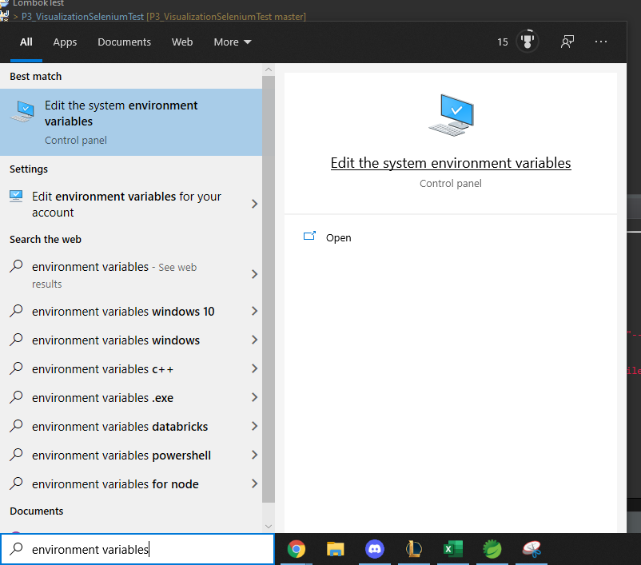
  3. click Environment Variables
      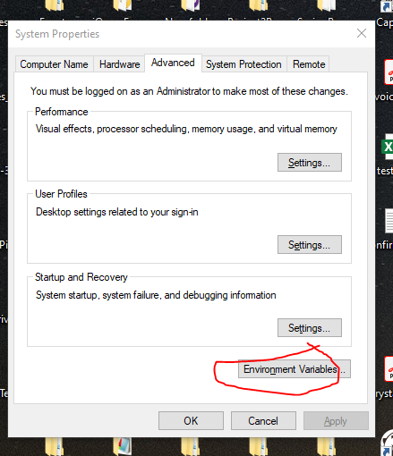
  4. Click New
      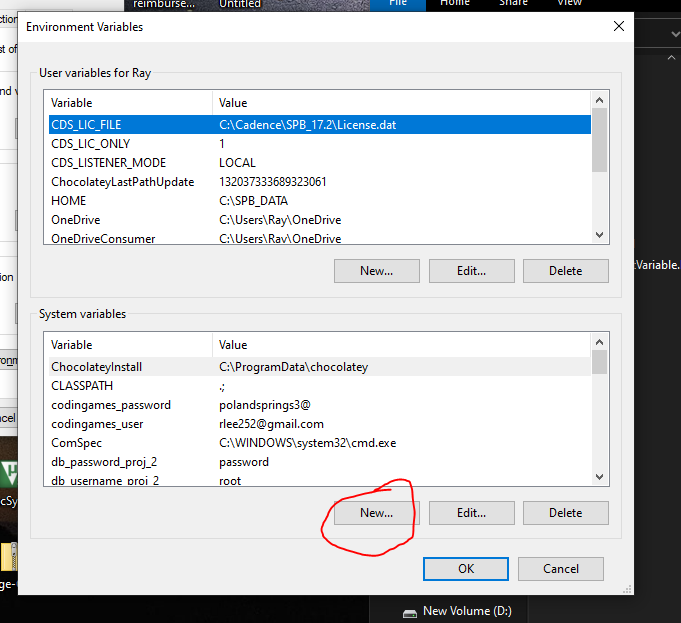
  5. In the Variable name input bar type "codingames_user" and for the Variable value input bar type your email address used for codingames.
      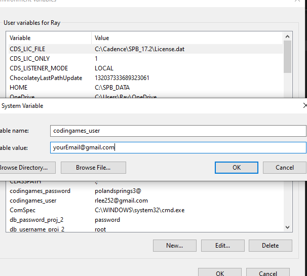
  6. Click Ok
  7. Click New
  8. In the Variable name input bar type "codingames_password" and for the Variable value input bar type your password used for codingames.
      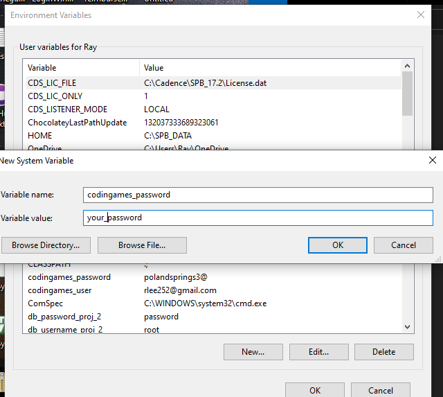
  9. click Ok

## How to Use Application
  1. After project has been downloaded or pulled, open the folder.
  2. Open the Codingames_automatation-master folder
   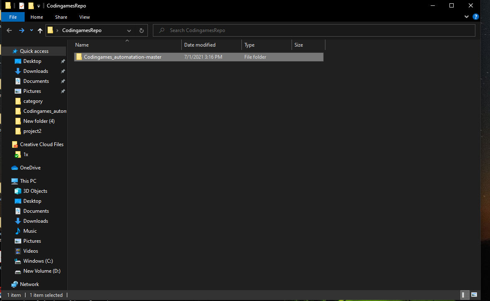
  3. Open the target folder 
   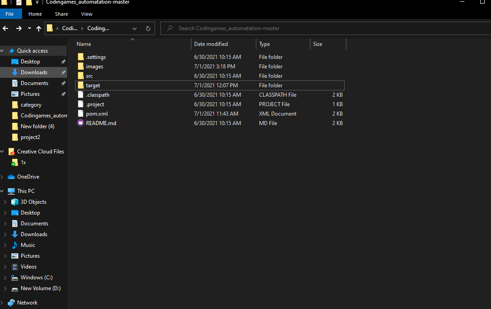
  4. Right click and select git bash here
   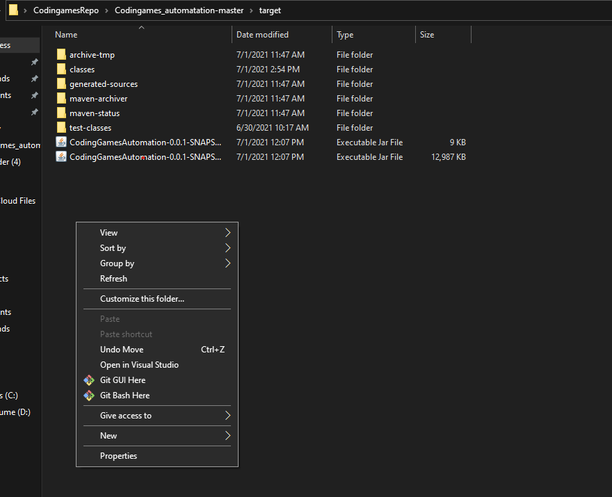
  5. Run the command $ java -jar CodingGamesAutomation-0.0.1-SNAPSHOT-jar-with-dependencies.jar in the git bash.
   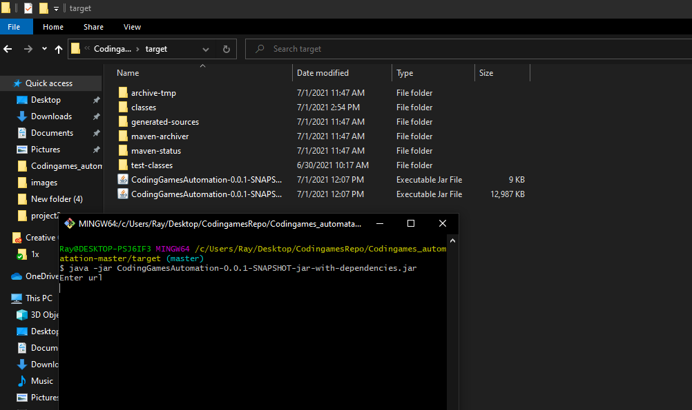
  6. Enter the codingame URL with the ranking table
   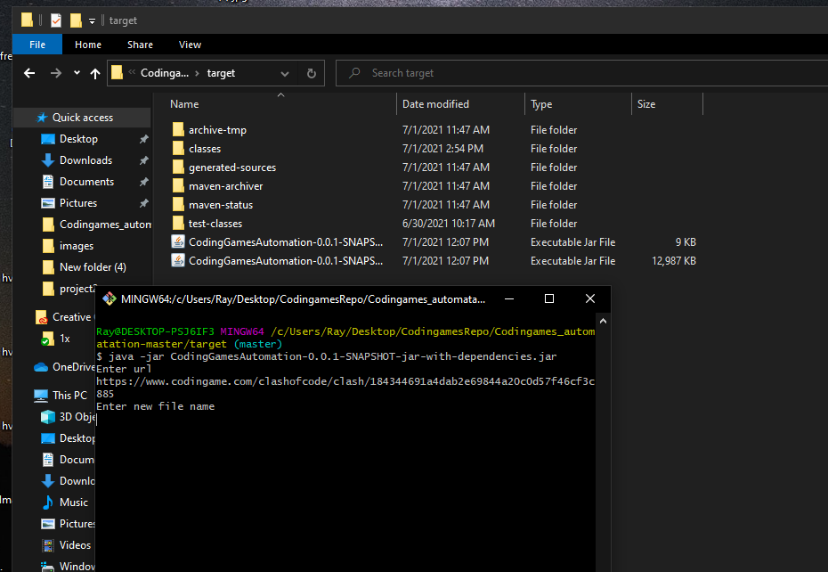
  7. Enter the file name
   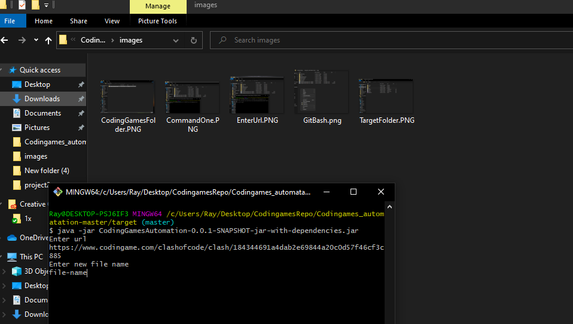
  8. When program is finished you will see the text "Have a nice day"
   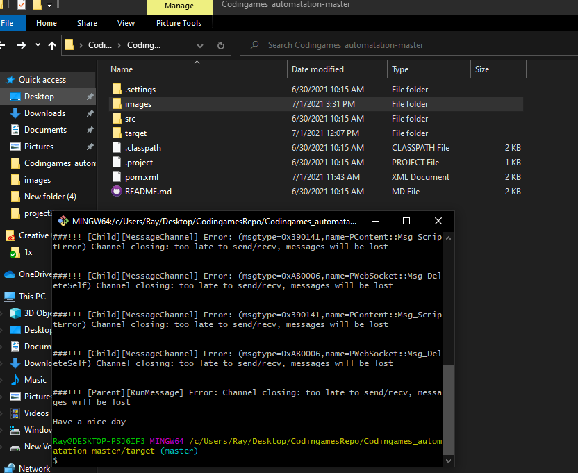
  12. Check your desktop for the csv file

## Contributors
- Chakong Xiong
- Cody Sutton
- Hetvi Patel
- Leah Harrichand
- Raymond Lee
